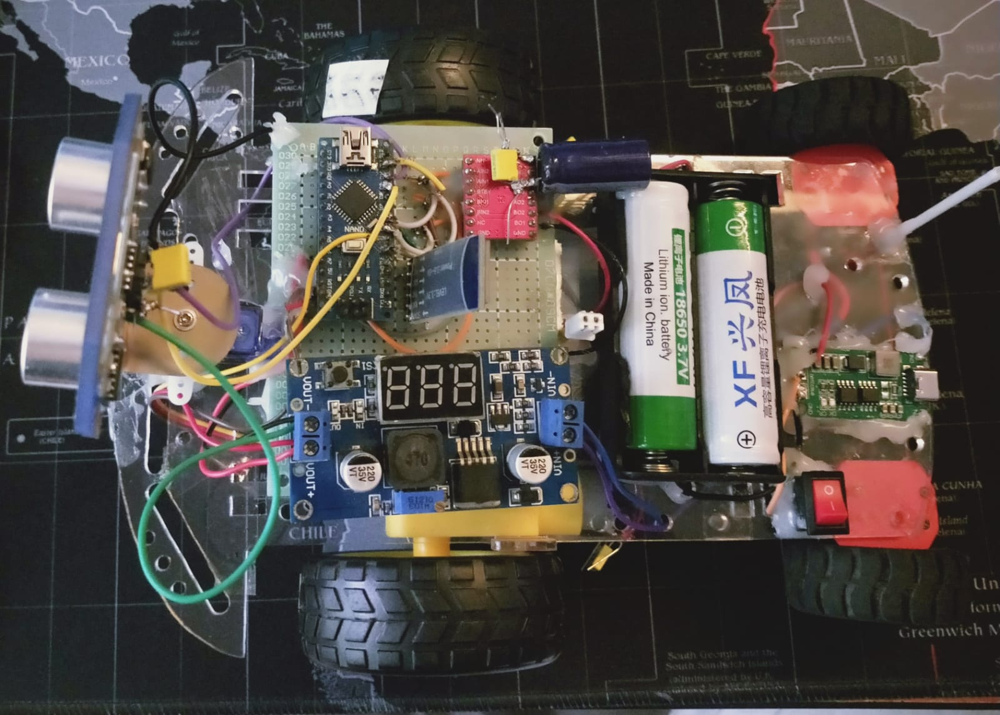
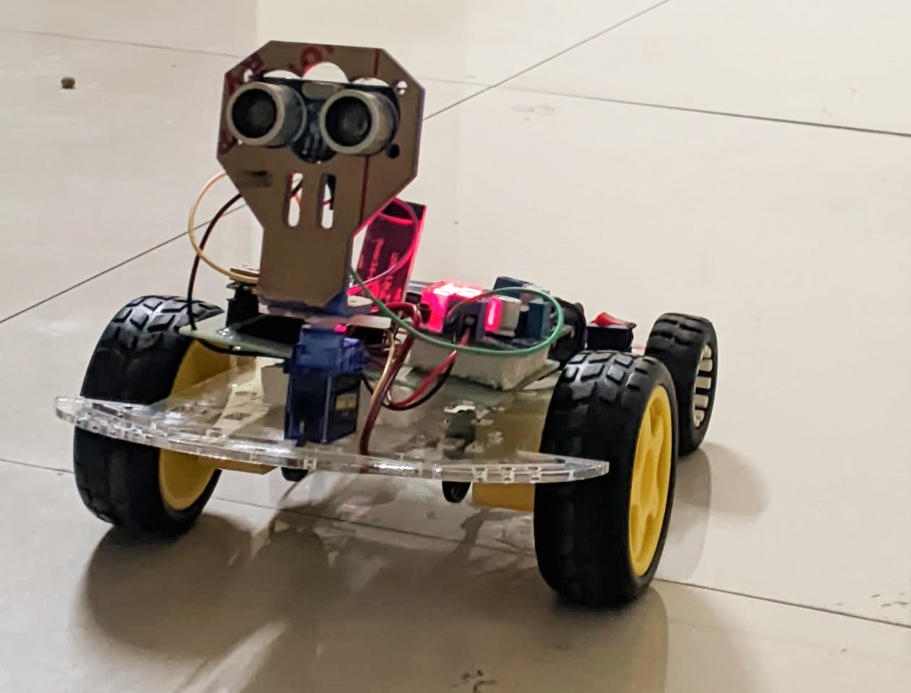
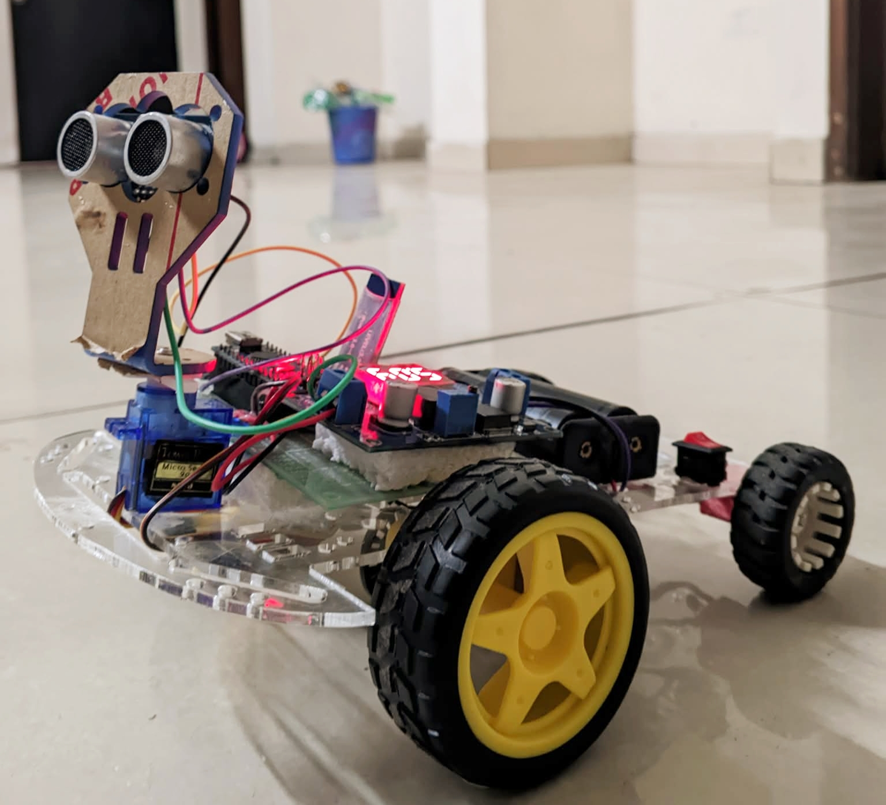
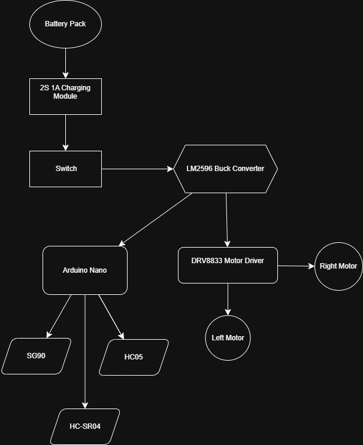

# Piku Robot OOP v1

## Overview

Piku Robot OOP v1 is an object-oriented autonomous mobile robot built using Arduino Nano.

The robot combines obstacle avoidance, ultrasonic sensing, servo scanning, and Bluetooth manual control within a modular OOP architecture.

This project was developed as a learning and research platform for future ESP32-based robotic systems.

## Robot Prototype

## System Architecture

---

## Features

- Autonomous obstacle avoidance
- Bluetooth manual control
- Ultrasonic distance measurement
- Servo-based environment scanning
- Object-Oriented software architecture
- Modular and expandable design

---

## Hardware Used

- Arduino Nano
- HC-SR04 Ultrasonic Sensor
- HC-05 Bluetooth Module
- SG90 Servo Motor
- DRV 8833 Motor Driver
- LM2596 Buck Converter
- DC Gear Motors
- Battery Pack
- 2s charging module
- 470uf, 100nf capacitors in both motors and drv vm-gnd

---

## Software Architecture (C++ OOP)

Robot
├── MotorDriver
├── DistanceSensor
├── ServoScanner
├── Navigator
└── BluetoothController

---

## Future Development

### Piku 2.0 (ESP32)

Planned upgrades:

- ESP32 controller
- WiFi dashboard
- Real-time sensor monitoring
- Autonomous mapping
- Path visualization
- Remote control from web interface
- Multi-sensor integration
- Environmental survey capability

---

## Author

MD Habibur Rahman Habib

Robotics | Embedded Systems | AI
